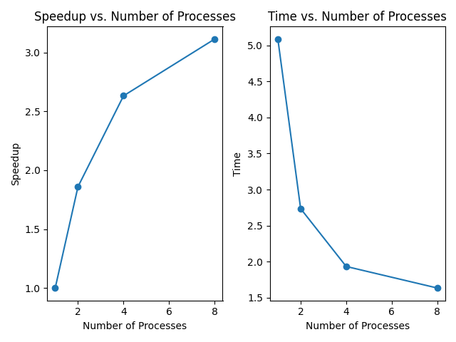

# Игра в жизнь MPI

Рост производительности при использовании MPI для параллельного выполнения игры "Жизнь" достигается за счет разделения 
задач между несколькими процессами, что позволяет выполнять вычисления одновременно. 

## Исследование

| кол-во процессов 	| среднее время (сек) 	|
|:----------------:	|:-------------------:	|
|         1        	|         5.09        	|
|         2        	|         2.74        	|
|         4        	|         1.93        	|
|         8        	|         1.63        	|

### График

# Заключение

Рост производительности в параллельных вычислениях с использованием MPI достигается за счет распределения работы 
между процессами и одновременного выполнения вычислений.